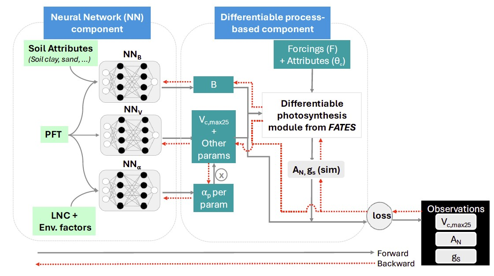

# diffEcosys_Acclimation

 
**Description**: Differentiable ecosystem model (δpsn) ramework. The δpsn framework integrates a neural network (NN) component with a differentiable process‐based model in this case the photosynthesis module from FATES. The NN component includes three networks—NNB, NNV, and NN⍺—each trained on different sets of predictors, such as soil attributes, plant functional type (PFT), leaf nitrogen content (LNC), and environmental conditions. These networks learn distinct parameters (including Vc,max25—the maximum carboxylation rate at 25°C, a key parameter representing plant photosynthetic capacity—and soil water constraint parameter Bi) that feed into the photosynthesis module along with meteorological forcings (F) and constant terrain attributes (θc). NN⍺ captures parameter acclimation to environmental factors, and predicts a perturbation term (⍺p) which is multiplied by each parameter (p) learned by NNV. The photosynthesis module then simulates AN (net photosynthesis) and gS (stomatal conductance). The outputs, including Vc,max25, are compared against multivariate observations to compute a loss function, which guides the backpropagation process to update the NN parameters.

**Citation**: Please cite this paper if the code is helpful to you.

Aboelyazeed, D., Xu, C., Gu, L., Luo, X.,
Liu, J., Lawson, K., & Shen, C. (2025).
Inferring plant acclimation and improving
model generalizability with differentiable
physics‐informed machine learning of
photosynthesis. Journal of Geophysical
Research: Biogeosciences, 130,
e2024JG008552. https://doi.org/10.1029/2024JG008552
